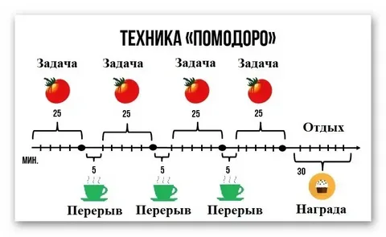

# TomatoTimer (vite + vanila + typescript)

Реализация [TomatoTimer](https://en.wikipedia.org/wiki/Pomodoro_Technique) на чистом TypeScript с гибкой настройкой. В коде оставил комментарии на русском для удобства (не бейте тапками!).



Идея в том, чтобы установить временные интервалы для работы, перерыва, отдыха и указать количество итераций (подходов к работе) перед отдыхом. После выполнения отдыха цикл запускается сначала.

> 


### Для запуска

```bash
> npm install
> npm run dev
```

### Для билда
```bash
> npm install
> npm run build
```